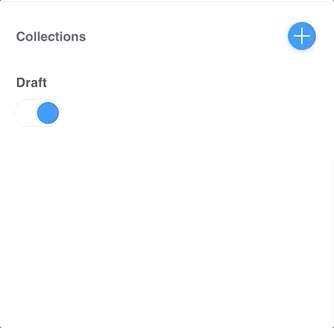
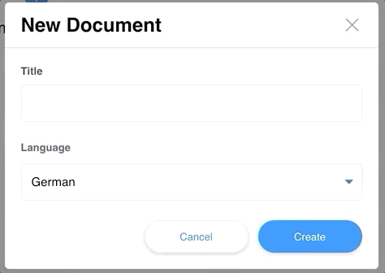

# tinacms-relation-field [](https://snyk.io/test/github/mmintel/tinacms-condition-field?targetFile=packages/tinacms-relation-field/package.json)

> Adds a relation field to TinaCMS

## Article
If you want to read more in depth walk through to how this condition field works, checkout my article here:
https://mintel.me/lets-create-a-relation-field-for-tinacms/


## Preview
### With multiple references


### With a single reference


## Install

```bash
npm install --save tinacms-relation-field
```

or

```bash
yarn add tinacms-relation-field
```

### Manual
You can either just install the `relation` field like this:
```jsx
import TinaCMSRelationField from 'tinacms-relation-field'

const relationField = new TinaCMSRelationField(tinacms);

relationField.install();
```

or you can install additional fields to save time when using them:
```jsx
import TinaCMSRelationField from 'tinacms-relation-field'

const relationField = new TinaCMSRelationField(tinacms);

relationField.install([{
  name: 'page',
  hook: usePages,
  itemProps: page => ({
    key: page.id,
    label: page.frontmatter.title,
  }),
  sortable: true,
  multiple: false,
  noDataText: 'No pages created',
}]);
```

This will add the `page` component to TinaCMS fields.

### with Gatsby
add to `gatsby-browser.js`
```jsx
import TinaCMSRelationField from 'tinacms-condition-field'

export const onClientEntry = () => {
  const relationField = new TinaCMSRelationField(window.tinacms);
  relationField.install();
}
```

## Usage
The relation component is applied when specifying `component: 'relation'` in your field. Alternatively you can register multiple fields upfront which I highly recommend, it will save a lot of time, just pass them to the `install` in this case and they will be available.

*Note:* you need to pass data to the relation field, this highly depends on your project structure. Checkout my example to see how I used a `usePages` hook in connection with `useStaticQuery` to pass the data from Gatsby to the relation field.

### Examples
If you only want to use the `relation` component, you can use it like this:
```js
{
  label: 'Page',
  name: 'page',
  component: 'relation',
  data: pages,
  itemProps: page => ({
    key: page.id,
    label: page.frontmatter.title,
  }),
  multiple: false,
  sortable: true,
  noDataText: 'No pages created',
}
```

or if you already registered the field with the `install` method:

```js
{
  label: 'Page',
  name: 'page',
  component: 'page'
}
```
